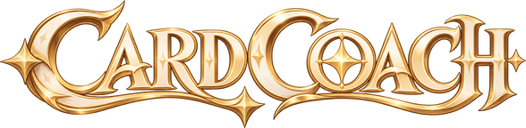

<div align="center">



<br>

### <span style="color:#D3BC8E">AI COACH FOR GENIUS INVOKATION TCG</span>

**Интеллектуальный советник для «Священного призыва семерых» в Genshin Impact**

<br>


<br><br>


&nbsp;
<a href="#запуск">Запуск</a>
&nbsp;&nbsp;·&nbsp;&nbsp;

&nbsp;
<a href="#как-пользоваться-во-время-партии">Как пользоваться</a>
&nbsp;&nbsp;·&nbsp;&nbsp;

&nbsp;
<a href="#архитектура">Архитектура</a>
&nbsp;&nbsp;·&nbsp;&nbsp;

&nbsp;
<a href="#распознавание-экрана-и-калибровка">Распознавание</a>
&nbsp;&nbsp;·&nbsp;&nbsp;

&nbsp;
<a href="#известные-ограничения">Ограничения</a>

</div>

<br>

---

##  О проекте

**Card Coach** анализирует изображение экрана, восстанавливает состояние партии и просчитывает варианты на несколько ходов вперёд.

Советник:

- анализирует текущую позицию;
- объясняет рекомендуемое действие;
- показывает альтернативы;
- оценивает риск и ожидаемый результат;
- проверяет результат вашего хода;
- может озвучить рекомендацию;
- сохраняет разбор завершённой партии.

> [!IMPORTANT]
> **Card Coach — советник, а не игровой бот.**
>
> В проекте отсутствует управление клавиатурой или мышью и отсутствует доступ к памяти игры.
> `DRY_RUN` всегда включён и не может быть отключён.
>
> Это дополнительно закреплено тестом:
> `tests/test_session_and_safety.py::test_no_game_control_code`

<br>

<table>
<tr>
<td align="center" width="25%">
<br>
<b>Планирование</b><br>
<sub>Поиск лучших ходов</sub>
</td>
<td align="center" width="25%">
<br>
<b>Vision</b><br>
<sub>Анализ игрового экрана</sub>
</td>
<td align="center" width="25%">
<br>
<b>Voice</b><br>
<sub>Голосовые рекомендации</sub>
</td>
<td align="center" width="25%">
<br>
<b>Safety</b><br>
<sub>Только советы</sub>
</td>
</tr>
</table>

---

##  Запуск

### Быстрый запуск

Двойной клик по ярлыку **Card Coach** на рабочем столе или по `Card Coach.bat` в папке проекта откроет отдельное окно приложения без консоли.

Кнопка **«Поверх»** удерживает окно поверх игры.

### Команды

```powershell
# Запустить приложение
.venv\Scripts\python run_coach.py

# Запустить веб-интерфейс
.venv\Scripts\python run_coach.py --browser

# Запустить демонстрационный сценарий
.venv\Scripts\python run_coach.py --demo lethal

# Запустить тесты
.venv\Scripts\python -m pytest -q
```

В браузерном режиме интерфейс доступен по:

```text
http://127.0.0.1:8765
```

### Установка

```powershell
python -m venv .venv
.venv\Scripts\pip install -r requirements.txt
```

---

##  Как пользоваться во время партии

###  Откройте игру

Откройте партию в **Genshin Impact**.

Для работы с коучем удобнее использовать оконный или безрамочный режим.

###  Настройте партию

В коуче нажмите **«Партия»** и укажите составы обеих команд.

По возможности добавьте карты в руке.

Персонажи и карты подставляются из базы вики.

###  Захватите экран

Нажмите **«Захват» (`F9`)** или включите **«Слежение»**.

В режиме слежения коуч анализирует экран после изменения изображения и завершения игровой анимации.

###  Выполните рекомендацию

Коуч показывает рекомендуемый ход.

**Ход выполняете вы самостоятельно в игре.**

После этого Card Coach сравнивает состояние до и после действия:

- `Ход подтверждён`
- `Сыграно другое действие`
- `Action result uncertain`

После проверки план пересчитывается.

###  Голосовые рекомендации

После каждого анализа экрана совет может быть озвучен голосом.

- `F8` — повторить совет;
- кнопка с динамиком — включить/выключить озвучку.

Для Google Chirp 3 HD требуется Google Cloud Text-to-Speech API key:

```text
⋯ → Голос и озвучка
```

или:

```toml
GOOGLE_TTS_API_KEY = "..."
```

Без ключа используется голос Windows.

> В Google передаётся только текст совета.

###  Завершение партии

После завершения партии:

```text
⋯ → Завершить партию и разобрать
```

Отчёт сохраняется в:

```text
data/matches/<id>/report.md
```

### Состояние с низкой уверенностью

Если уверенность распознавания ниже `CONFIDENCE_THRESHOLD`, совет не выдаётся.

Вместо этого показывается:

> Не удалось уверенно распознать состояние. Обновите экран или сделайте скриншот.

Если неверно определено, **чей сейчас ход**, нажмите на соответствующую плашку в шапке — состояние переключится.

---

##  Данные и база знаний

Все персонажи, навыки, призывы, статусы и карты импортируются со страницы:

**«Список карт» русской вики Genshin Impact.**

Импортёр использует MediaWiki API и те же категории, из которых собраны таблицы страницы.

### Обновление базы

```powershell
# Скачать заново и пересобрать базу
.venv\Scripts\python -m gcoach.tools.wiki_import

# Пересобрать из локального кэша
.venv\Scripts\python -m gcoach.tools.wiki_import --offline
```

### Данные

Результат находится в:

```text
gcoach/knowledge/data/
```

Основные файлы:

```text
characters.json
cards.json
summons.json
statuses.json
reactions.json
manifest.json
```

Текстовые эффекты преобразуются в игровую механику регулярными выражениями:

- урон;
- стихия;
- стоимость;
- пронзающий урон;
- призывы;
- щиты;
- снижение урона;
- инфузии;
- бонусы урона;
- энергия;
- другие механики.

Если эффект невозможно разобрать, он сохраняется как текст с пометкой:

```text
не смоделировано
```

Движок не выдумывает неизвестную механику, а советник не предлагает несмоделированные карты.

### Текущая статистика импорта

| Категория | Количество |
|---|---:|
| Персонажи | **174** |
| Навыки | **567** |
| Полностью разобранные навыки | **436** |
| Призывы | **82** |
| Смоделированные призывы | **76** |
| Карты действий | **342** |
| Смоделированные карты | **120** |
| Реакции | **11** |

---

##  Архитектура

```text
┌──────────────┐
│    Экран     │
└──────┬───────┘
       │
       ▼
┌──────────────┐
│ screen_capture│
└──────┬───────┘
       │
       ▼
┌──────────────────┐
│ vision + OCR     │
└──────┬───────────┘
       │
       ▼
┌──────────────────┐
│ reconstruct      │
└──────┬───────────┘
       │
       ▼
┌──────────────────┐
│    GameState     │
└──────┬───────────┘
       │
       ▼
┌──────────────────┐
│  Rules Engine    │
└──────┬───────────┘
       │
       ▼
┌──────────────────┐
│     Planner      │
└──────┬───────────┘
       │
       ▼
┌──────────────────┐
│ Recommendation   │
└──────┬───────────┘
       │
       ▼
┌──────────────────┐
│       UI         │
└──────┬───────────┘
       │
       ▼
┌──────────────────┐
│   Verification   │
└──────────────────┘

        ▲
        │
        │ пользователь
        │ выполняет ход
        │ самостоятельно
```

### Модули

| Модуль | Назначение |
|---|---|
| `gcoach/core` | `GameState`, `Action`, `Observed`, оплата кубиками |
| `gcoach/knowledge` | Импорт вики и типизированная база знаний |
| `gcoach/rules` | Детерминированный движок правил |
| `gcoach/ai/generator.py` | Генерация всех легальных действий |
| `gcoach/ai/evaluation.py` | Оценка позиции по 14 признакам |
| `gcoach/ai/opponent.py` | Модель поведения противника |
| `gcoach/ai/planner.py` | Expectimax, beam search и iterative deepening |
| `gcoach/ai/recommendation.py` | Рекомендация, стоимость, риск и альтернативы |
| `gcoach/verification` | Сравнение состояния до и после хода |
| `gcoach/memory` | Память партии и финальный разбор |
| `gcoach/providers` | AI-провайдеры |
| `gcoach/screen_capture` | Захват экрана |
| `gcoach/vision` | Распознавание элементов |
| `gcoach/ocr` | Распознавание чисел |
| `gcoach/server` | Локальный сервер |
| `gcoach/web` | Веб-интерфейс |

---

##  Планирование

### Наши узлы

Каждое действие симулируется и сортируется по оценке.

На следующую глубину проходят лучшие:

```text
BEAM_WIDTH
```

Быстрые действия не расходуют глубину поиска.

### Узлы противника

Используется модель:

```text
λ · worst_response + (1 − λ) · expectation
```

где:

```text
ROBUST_LAMBDA
```

определяет степень осторожности.

Противник не считается ни полностью случайным, ни всезнающим.

### Граница поиска

Поиск останавливается в конце раунда.

Кубики перебрасываются, поэтому следующий раунд оценивается эвристикой, а не угадывается напрямую.

### Выбор победной линии

Если существуют две одинаково выигрышные линии, предпочтение получает:

1. более быстрая линия;
2. линия, в которой противник не успевает совершить ответный ход.

---

##  Распознавание экрана и калибровка

Координаты интерфейса находятся в:

```text
assets/layouts/default_16x9.json
```

Координаты задаются относительно ширины и высоты окна игры.

> [!WARNING]
> Разметка по умолчанию приблизительная и не проверялась на реальных скриншотах Genshin Impact.

Перед использованием необходимо выполнить калибровку.

```powershell
.venv\Scripts\python -m gcoach.tools.calibrate мой_скриншот.png
```

Команда создаёт изображения:

```text
*_layout.jpg
```

и показывает, какие элементы были распознаны.

После этого необходимо скорректировать значения в JSON, чтобы рамки совпадали с:

- HP;
- энергией;
- счётчиками кубиков;
- другими элементами интерфейса.

После завершения:

```json
"calibrated": true
```

### Шаблоны

Шаблоны можно добавлять без изменения исходного кода:

```text
assets/<категория>/
```

Имя PNG должно совпадать с `id` объекта в базе.

Пример:

```powershell
.venv\Scripts\python -m gcoach.tools.make_template shot.png --category characters --name "Дилюк" --rect 700,620,160,200

.venv\Scripts\python -m gcoach.tools.make_template shot.png --category ui/digits --name 7 --rect 690,610,18,26
```

### OCR

Для надёжного чтения чисел необходимы шаблоны цифр:

```text
assets/ui/digits/
```

или установленный Tesseract.

Конфигурация:

```toml
OCR_ENGINE = "tesseract"
```

Если ни шаблонов, ни Tesseract нет, OCR отключён, а Card Coach честно сообщает, что состояние не удалось распознать.

### Что именно распознаётся

| Элемент | Метод |
|---|---|
| HP | OCR |
| Количество кубиков | OCR |
| Энергия | Анализ цвета |
| Аура | Анализ цвета |
| Грани кубиков | Анализ цвета |
| Активный персонаж | Сдвиг карты к центру |
| Поверженный персонаж | Серая карта |
| Персонажи | Шаблоны |
| Карты | Шаблоны |
| Призывы | Шаблоны |

---

##  Конфигурация

Основные параметры находятся в:

```text
config.toml
```

Доступные настройки включают:

```text
SCREEN_REGION
MONITOR
OCR_ENABLED
DEBUG_MODE
PLANNING_DEPTH
BEAM_WIDTH
LETHAL_DEPTH
CONFIDENCE_THRESHOLD
AI_PROVIDER
AI_MODEL
AI_TIMEOUT
SCREENSHOT_INTERVAL
LOG_LEVEL
```

Значения по умолчанию:

```text
PLANNING_DEPTH = 3
BEAM_WIDTH = 10
LETHAL_DEPTH = 5
```

Любую настройку можно переопределить через переменную окружения:

```text
GCOACH_<ИМЯ>
```

---

##  Claude

Claude является необязательной интеграцией.

Конфигурация:

```toml
AI_PROVIDER = "claude"
```

API key:

```text
ANTHROPIC_API_KEY
```

Claude вызывается **только вручную**:

```text
Объяснить
```

или

```text
Комментарий к разбору партии
```

Все игровые расчёты выполняются локально.

Модель по умолчанию:

```text
claude-opus-5-5
```

При отклонении запроса включён серверный fallback на другую модель.

---

##  Отладка

Открывается через:

```text
⋯ → Отладка
```

или клавишей:

```text
`
```

Доступные разделы:

- скриншот с распознанными областями;
- таблица уверенности;
- кандидаты распознавания;
- дерево планов;
- журнал;
- необработанный `GameState`.

Диагностические изображения:

```text
debug/screenshots/
```

---

##  Известные ограничения

- Разметка экрана пока не откалибрована.
- Шаблонов персонажей и цифр пока нет.
- Без калибровки распознавание реального экрана может быть неуверенным.
- Составы команд необходимо задать через раздел **«Партия»**.
- Смоделирована только часть эффектов карт и статусов.
- Остальные эффекты помечаются как несмоделированные.
- Пассивные навыки персонажей пока не моделируются.
- Статусы и экипировка с экрана пока не читаются.
- Эти данные переносятся из предыдущего состояния как `INFERRED`.
- Выбор нового активного персонажа противника после поражения моделируется эвристикой.

---

##  Шрифт Genshin

Интерфейс использует шрифт интерфейса **Genshin Impact — SDK_SC_Web** с поддержкой кириллицы.

Шрифт берётся из установленной игры и **не входит в репозиторий**.

Для повторной подготовки шрифта:

```powershell
.venv\Scripts\python -m gcoach.tools.extract_font
```

Или указать путь вручную:

```powershell
.venv\Scripts\python -m gcoach.tools.extract_font --src "D:\Games\Genshin Impact"
```

Если файл шрифта не найден, используется свободная альтернатива:

```text
Rubik
```

---

<div align="center">

<br>


<br><br>


**CARD COACH**

<sub>AI-powered companion for Genius Invokation TCG</sub>

<br><br>


</div>
